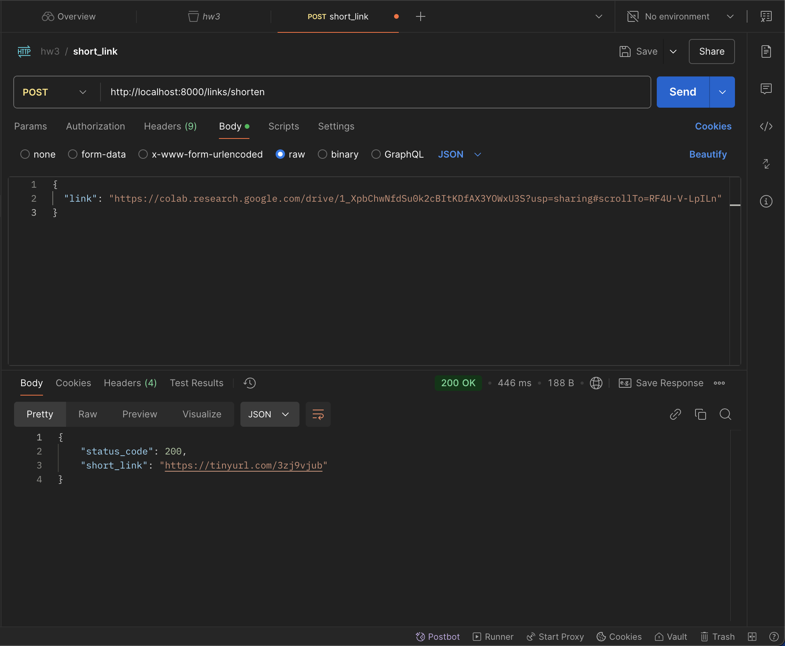
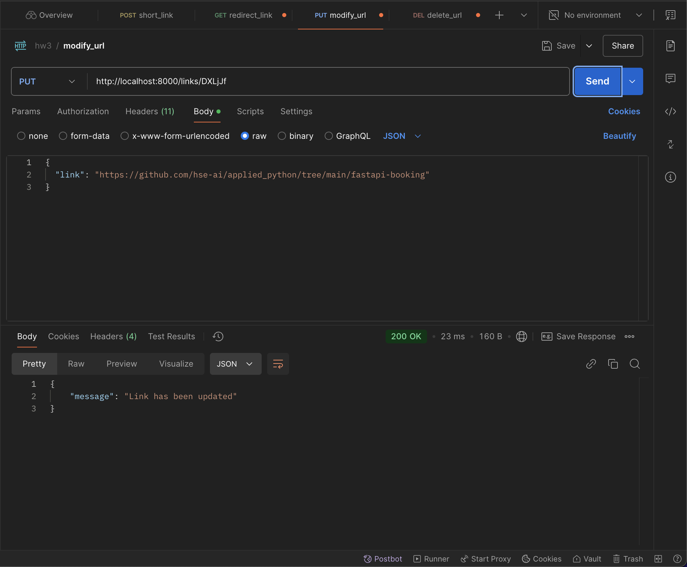
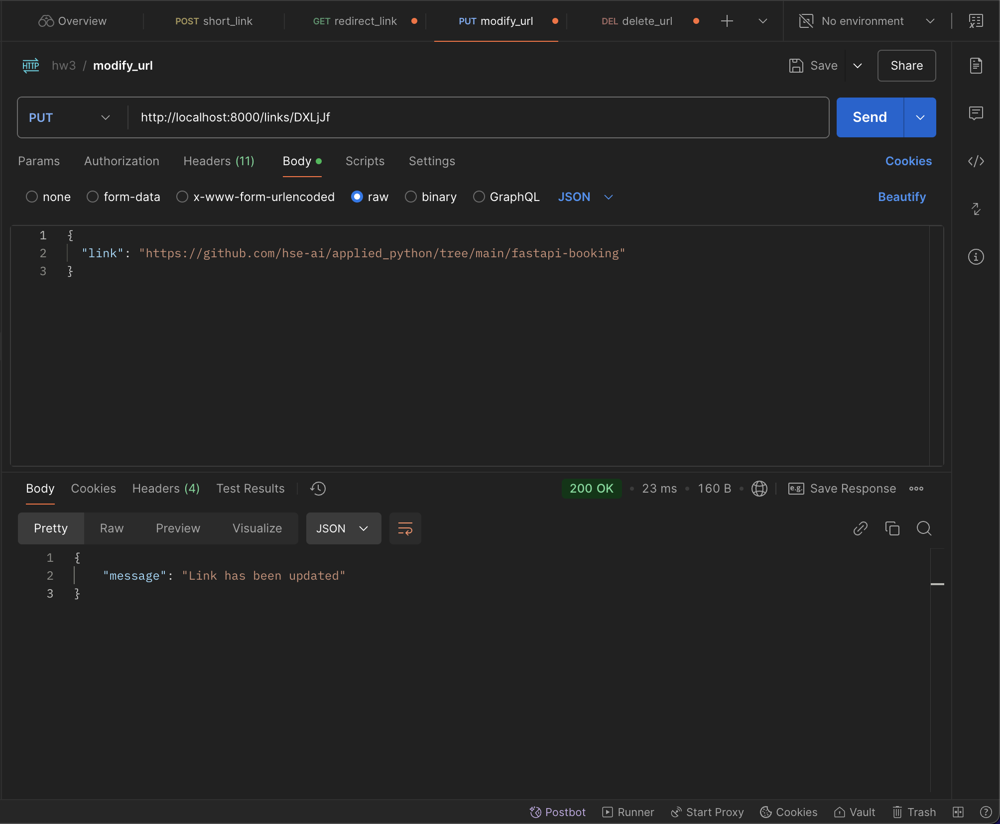
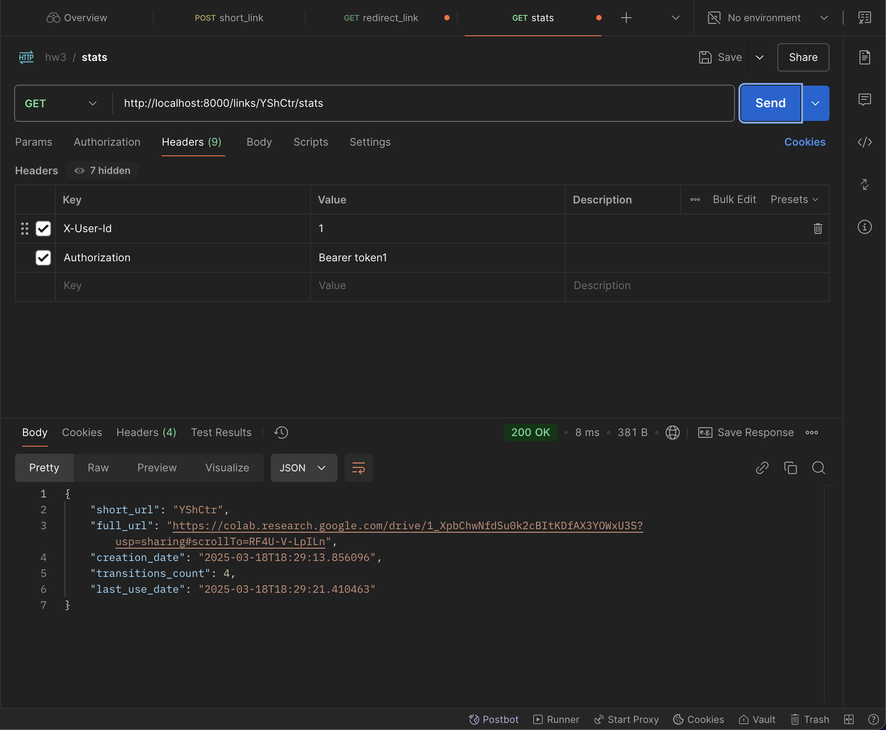

# 1. Демонстрация работы эндпоинтов
## 1.1. Создание / удаление / изменение / получение информации по короткой ссылке:
Проверка работоспособности эндпоинтов осуществлялась с помощью Postman запросов.
`POST /links/shorten`

`GET /links/{short_code}`

`DELETE /links/{short_code}`

`PUT /links/{short_code}`

`GET /links/{short_code}/stats`
