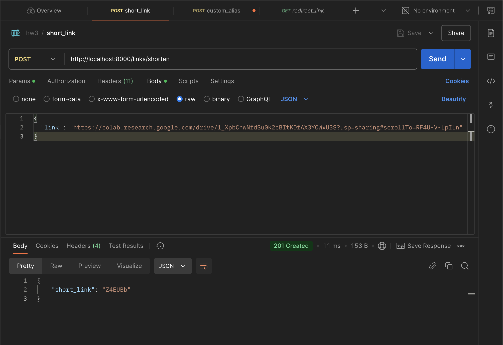
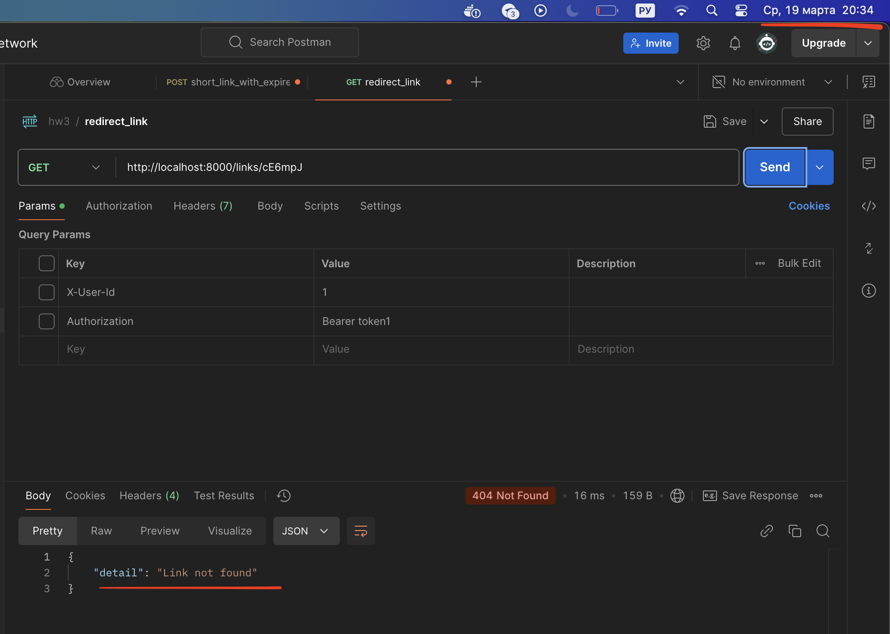

# 1. Демонстрация работы эндпоинтов
Проверка работоспособности эндпоинтов осуществлялась с помощью Postman запросов.
# 1.1. Обязательные функции
## 1.1.1. Создание / удаление / изменение / получение информации по короткой ссылке:
`POST /links/shorten`

`GET /links/{short_code}`

`DELETE /links/{short_code}`

`PUT /links/{short_code}`

## 1.1.2. Статистика по ссылке:
`GET /links/{short_code}/stats`

## 1.1.3. Создание кастомных ссылок с уникальным alias:
`POST /links/custom_shorten`

## 1.1.4. Поиск ссылки по оригинальному URL:
`GET /links/search?original_url={url}`

## 1.1.5. Указание времени жизни ссылки:
`POST /links/shorten`

`POST /links/custom_shorten`

## 1.2. Дополнительные функции
### 1.2.1. Удаление всех неиспользуемых ссылок:
Реализовано с использованием sheduler в классе APP. При этом sheduler каждые 5 минут удаляет ссылки, перенося их в специальную таблицу с просроченными ссылками.

### 1.2.2. Информации о количестве автивных и истекших ссылок для каждого пользователя:
Функция может быть полезна для платного сервиса для отслеживания и контроля расходов, либо биллинга
`GET /overview`
