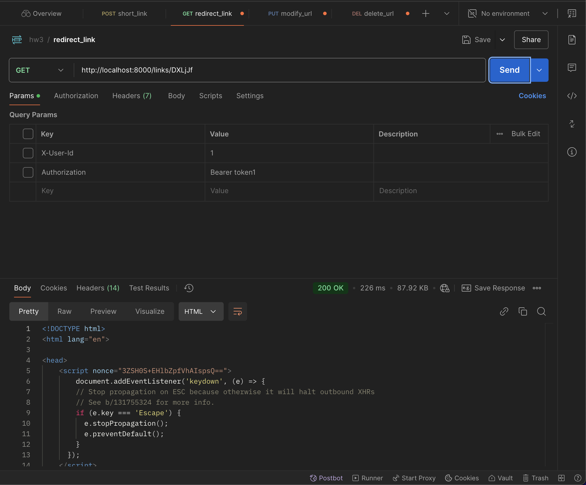

# 1. Описание API и примеры работы запросов
Проверка работоспособности эндпоинтов осуществлялась с помощью Postman запросов.
# 1.1. Обязательные функции
## 1.1.1. Создание / удаление / изменение / получение информации по короткой ссылке:
`POST /links/shorten`

`GET /links/{short_code}`

`DELETE /links/{short_code}`

`PUT /links/{short_code}`

## 1.1.2. Статистика по ссылке:
`GET /links/{short_code}/stats`

## 1.1.3. Создание кастомных ссылок с уникальным alias:
`POST /links/custom_shorten`

## 1.1.4. Поиск ссылки по оригинальному URL:
`GET /links/search?original_url={url}`

## 1.1.5. Указание времени жизни ссылки:
`POST /links/shorten`

`POST /links/custom_shorten`

## 1.2. Дополнительные функции
### 1.2.1. Удаление всех неиспользуемых ссылок:
Реализовано с использованием sheduler в классе APP. При этом sheduler каждые 5 минут удаляет ссылки, перенося их в специальную таблицу с просроченными ссылками.

### 1.2.2. Информации о количестве автивных и истекших ссылок для каждого пользователя:
Функция может быть полезна для патного сервиса для отслеживания и контроля расходов, либо биллинга
`GET /overview`

# 2. Подтверждение деплоя на хостинге

# 3. Инструкция по запуску
Файлы проекта необходимо загрузить с репозитория GitHub. Поскольку проект содержит файл `docker-compose.yml` сборка и запуск проекта осуществляется командой:
`docker-compose up --build`

# 4. Описание БД
База данных состоит из четырех таблиц: users, links, statistics, и expired_links. Ниже приведено подробное описание каждой таблицы.
1. Таблица users хранит информацию о пользователях: 
- id: идентификатор пользователя (SERIAL PRIMARY KEY).
- token: токен пользователя (TEXT NOT NULL).
2. Таблица links: хранит информацию о коротких ссылках.
Структура:
- id: идентификатор ссылки (SERIAL PRIMARY KEY).
- full_link: полная ссылка (VARCHAR(255) NOT NULL).
- short_link: короткая ссылка (VARCHAR(255) NOT NULL).
- created_at: дата и время создания ссылки (TIMESTAMP DEFAULT CURRENT_TIMESTAMP).
- expires_at: дата и время истечения срока действия ссылки (TIMESTAMP).
- user_id: идентификатор пользователя, создавшего ссылку (INTEGER).
- is_authorized: флаг, указывающий, создана ли ссылка авторизованным пользователем (BOOLEAN DEFAULT FALSE).
3. Таблица statistics: хранит статистику доступа к коротким ссылкам.
Структура:
- id: идентификатор записи (SERIAL PRIMARY KEY).
- short_link: короткая ссылка (VARCHAR(255) NOT NULL).
- access_date: дата и время доступа к ссылке (TIMESTAMP DEFAULT CURRENT_TIMESTAMP).
4. Таблица expired_links: хранит информацию о просроченных ссылках.
Структура:
- id: идентификатор просроченной ссылки (SERIAL PRIMARY KEY).
- full_link: полная ссылка (VARCHAR(255) NOT NULL).
- short_link: короткая ссылка (VARCHAR(255) NOT NULL).
- created_at: дата и время создания ссылки (TIMESTAMP).
- expires_at: дата и время истечения срока действия ссылки (TIMESTAMP).
- deleted_at: дата и время удаления ссылки (TIMESTAMP DEFAULT CURRENT_TIMESTAMP).
- user_id: идентификатор пользователя, создавшего ссылку (INTEGER).
- is_authorized: флаг, указывающий, создана ли ссылка авторизованным пользователем (BOOLEAN DEFAULT FALSE).